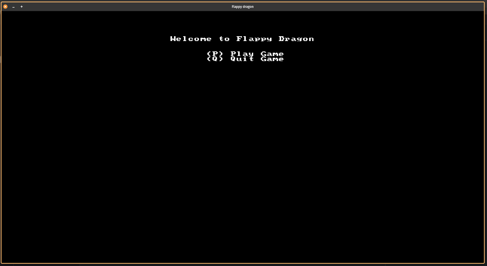
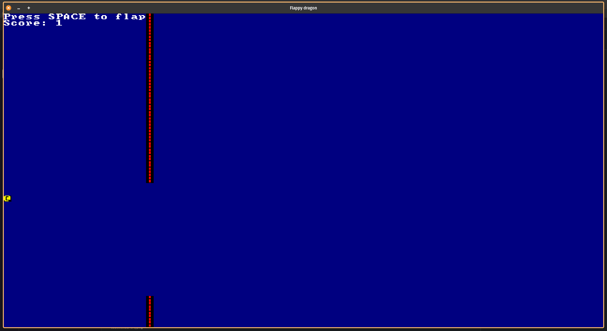
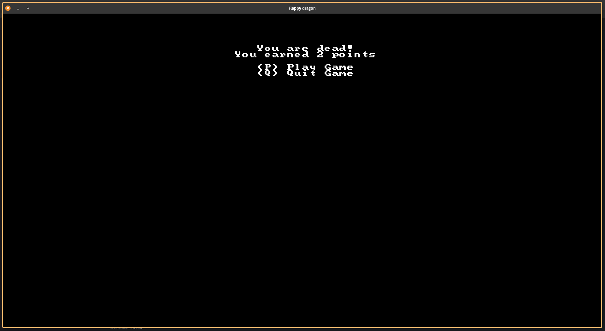

# flappy-ascii

The flappy bird clone created to run inside terminal. It's the part of 
"Hands-on Rust Effective Learning through 2D Game Development and Play" [book](https://hands-on-rust.com/) build in Rust

### build

* install [Rust](https://www.rust-lang.org/tools/install)

* cargo run

### demo

* 
* 
* 

